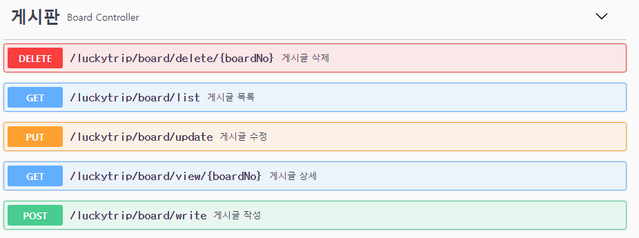
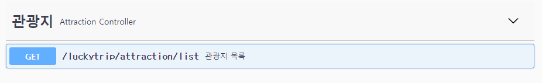
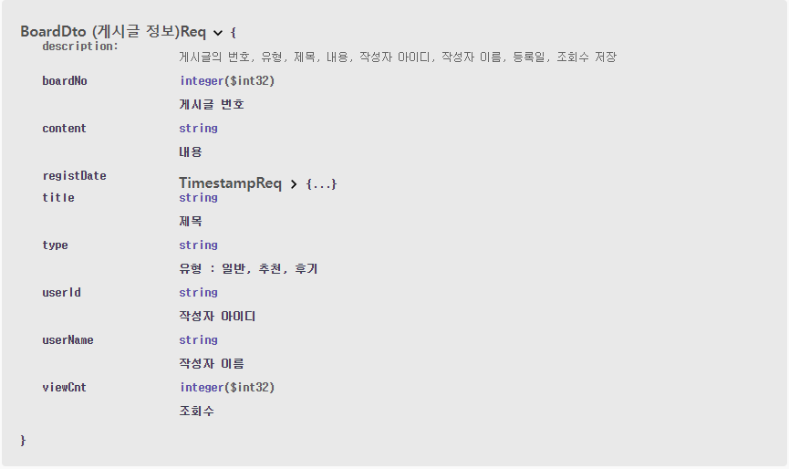
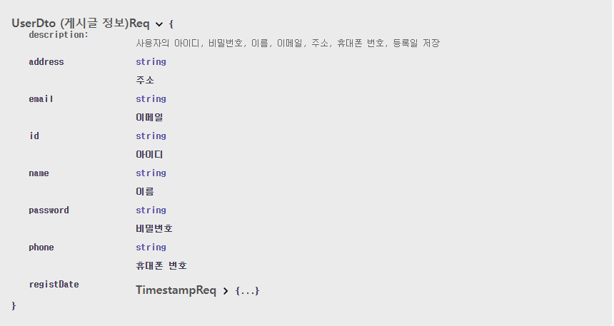

# 🍪LUCKY TRIP RestApi 명세서

## 1. 주요 기능

- 게시판

  - 모든 게시글 목록 (getBoardListAll)
  - 특정 게시글 상세 (getBoardView)
  - 게시글 작성 (writeBoard)
  - 게시글 수정 (updateBoard)
  - 게시글 삭제 (deleteBoard)
     

- 회원
  - 로그인 (login)
  - 로그아웃 (logout)
  - 회원정보 (userInfo)
  - 회원가입 (join)
  - 아이디 중복 체크 (idCheck)
  - 회원 수정 (modify)
  - 회원 탈퇴 (delete)
     
- 관광지
  - 관광지 목록 (getAttractionList)

---

## 2. Swagger

### 1. Controller 명세서

 

### 2. Dto 명세서

## 👪참여자

😺 SSAFY 9기 전재우

😎 SSAFY 9기 강수창
